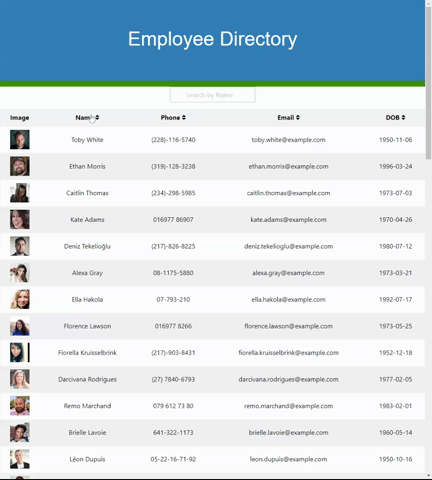

# Employee Directory

This project is an example CRM implemented as an employee roster. You can sort (ascending or descending) a roster of employees by their name, phone number, email, and date of birth. Clicking on the header for each column will cause the roster to be sorted using that field. Each click on the header will alternate between ascending and descending order. It is also possible to filter employees by their name using the search bar. Currently is is not possible to filter employees on fields other than name. The current roster shown on the page is a set of randomly generated users from [Random User Generator](https://randomuser.me/).



## Table of Contents

| |||
|:-|:-|:-|
| [Project Introduction](#employee-directory) | [Table of Contents](#table-of-contents) | [Goals and Methods](#goals-and-methods) 
| [Deployed Link](#deployed-link) | [Technologies](#technologies) | [Author](#author) 
| [Acknowledgments](#acknowledgments) | [License](#license) |
---

## Goals and Methods

The primary purpose of this project was to continue developing my skills in React. This time around I opted to focus on using function hooks as a way to create and manage state. Several pieces of state were used to modify the page based on user interaction. For instance the contents of the search bar were modeled as a stately string:
```javascript
const [searchTerm, setSearchTerm] = useState("");
```
This piece of state was passed down as a prop to the search component along with a funtion to handle input changes. The input change handling function had access to the state of the search bar and would use the associated setter after manipulating the input:
```javascript
const handleInputChange = event => {
  setSearchTerm(event.target.value.toLowerCase());  
};
```
Since the contents of the seach bar were available in state it became possible to use that information to filter the employee roster. Filtering the roster happens anytime the contents of the search bar change by employing the following:
```javascript
useEffect(() => {
  if (searchTerm) {
    loadEmpsByName();
  }    
}, [searchTerm]);
```
The last step of the filtering process was to check and see if the search term was included in each employees' name:
```javascript
const loadEmpsByName = () => {
  let tempArr = emps.filter(emp => emp.empname.toLowerCase().includes(searchTerm));
  setFilterEmps(tempArr);
};
```
The other major feature of the application is the ability to sort roster on a field such as name. Each field has its own state value to track if it was last sorted in ascending or descending order. In the case that this is the first time the field has been sorted it will default to descending order. Each column had state that resembled:
``` javascript
const [nameOrder, setNameOrder] = useState("");
```
Each of these were initialized to an emtpy state to match the unsorted nature of employee roster. However clicking a header fires a sorting function which was passed down as a prop to the table component:
```javascript
  const handleNameSort = event => {
    let sort = event.target.getAttribute("data-value");

    if (sort === "descending") {
      setEmps(emps.sort((a,b)=> (a.empname < b.empname ? 1 : -1)));
      setNameOrder("ascending");
    } else if ( sort === "ascending") {
      setEmps(emps.sort((a,b)=> (a.empname > b.empname ? 1 : -1)));
      setNameOrder("descending");
    } else {
      setEmps(emps.sort((a,b)=> (a.empname > b.empname ? 1 : -1)));
      setNameOrder("descending");
    }
  }
```
Each column has its own state and sorting function equipped with the appropriate state setter.

## Deployed Link

[Deployed to GitHub Pages](https://coleman-buffa.github.io/employee-directory/)

## Technologies 

[React](https://reactjs.org/)

[Foundation](https://get.foundation/)

[Axios](https://www.npmjs.com/package/axios)

[GH-Pages](https://www.npmjs.com/package/gh-pages)

## Author

Coleman Buffa

* [Git Hub](https://github.com/coleman-buffa/employee-directory)
* [My Portfolio](https://colemanbuffa-portfolio.herokuapp.com/)
* [LinkedIn](https://www.linkedin.com/in/coleman-buffa/)

## Acknowledgments

My thanks to the many mentors and friends who are a constant source of project ideas, learning topics, and guidance.

## License

[](https://opensource.org/licenses/MIT)

### [Back to Table of Contents](#table-of-contents)